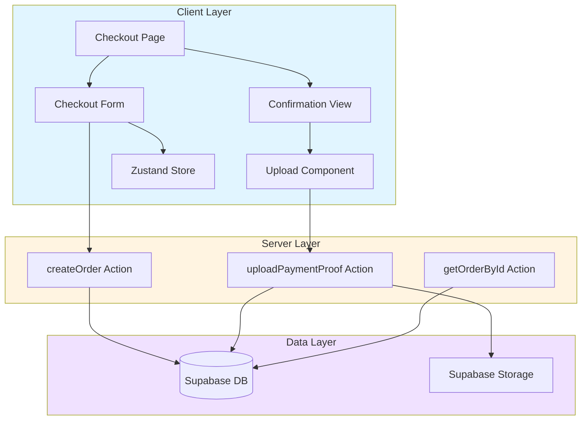

# Design Document: Checkout Flow

## Overview

The Checkout Flow feature enables buyers to complete purchases of digital products through a multi-step process: form validation, order creation, confirmation display, and payment proof upload. This design integrates the existing checkout page with Supabase database operations, Supabase Storage for file uploads, and Zustand state management.

### Key Design Goals

1. **Seamless Integration**: Connect existing UI components with server actions and database operations
2. **Robust Validation**: Implement client-side and server-side validation to ensure data integrity
3. **Clear User Feedback**: Provide immediate feedback for validation errors and async operations
4. **Secure File Handling**: Safely upload and store payment proof files in Supabase Storage
5. **State Consistency**: Maintain cart state consistency across checkout flow transitions

### Technology Stack

- **Frontend**: Next.js 15 (App Router), React, TypeScript
- **State Management**: Zustand with persistence
- **Backend**: Next.js Server Actions
- **Database**: Supabase (PostgreSQL)
- **Storage**: Supabase Storage
- **UI Components**: shadcn/ui (Radix UI primitives)

---

## Architecture

### High-Level Architecture



### Data Flow

**Order Creation Flow:**
1. User fills checkout form → Client-side validation
2. Form submits → `createOrder()` server action
3. Server action creates order record → Supabase `orders` table
4. Server action creates order items → Supabase `order_items` table
5. Server returns `orderId` → Client updates UI to confirmation view
6. Client clears cart → Zustand store persists empty cart

**Payment Proof Upload Flow:**
1. User selects file → Client validates file type and size
2. Client uploads file → Supabase Storage bucket `payment-proofs`
3. Storage returns public URL → Client calls `uploadPaymentProof()` action
4. Server action updates order record → Sets `payment_proof` column
5. Client displays success message → Hides upload component

### Authentication Integration

The checkout flow supports both authenticated and guest users:

- **Authenticated users**: Auto-fill name and email from Supabase Auth session, include `user_id` in order
- **Guest users**: Manual entry of name and email, `user_id` stored as `null`

---

## Components and Interfaces

### Component Structure

```
app/checkout/page.tsx (Container)
├── CheckoutForm (Form view)
│   ├── BuyerInfoSection
│   │   ├── Input (name)
│   │   └── Input (email)
│   ├── PaymentMethodSection
│   │   └── RadioGroup (bank selection)
│   ├── OrderItemsSection
│   │   └── OrderItemCard[] (cart items)
│   └── OrderSummaryCard
│       └── Button (submit)
└── ConfirmationView (Success view)
    ├── OrderDetails
    ├── PaymentInstructions
    └── PaymentProofUpload
        ├── FileInput
        └── UploadButton
```

### Component Interfaces

#### CheckoutForm Component

```typescript
interface CheckoutFormProps {
  onOrderCreated: (orderId: string) => void
}

interface CheckoutFormState {
  buyerName: string
  buyerEmail: string
  selectedBank: string
  errors: {
    name?: string
    email?: string
  }
  isSubmitting: boolean
}
```

**Responsibilities:**
- Render form fields for buyer information
- Validate inputs on blur and submit
- Call `createOrder()` server action
- Clear cart on successful order creation
- Transition to confirmation view

#### ConfirmationView Component

```typescript
interface ConfirmationViewProps {
  orderId: string
  grandTotal: number
  selectedBank: string
  orderItems: CartItem[]
}

interface ConfirmationViewState {
  paymentProofUploaded: boolean
  uploadProgress: number
  uploadError: string | null
}
```

**Responsibilities:**
- Display order summary and payment instructions
- Render payment proof upload component
- Handle file upload to Supabase Storage
- Call `uploadPaymentProof()` server action
- Provide navigation to dashboard and products

#### PaymentProofUpload Component

```typescript
interface PaymentProofUploadProps {
  orderId: string
  onUploadSuccess: () => void
}

interface PaymentProofUploadState {
  selectedFile: File | null
  isUploading: boolean
  uploadError: string | null
}
```

**Responsibilities:**
- Accept file selection (JPG, PNG, PDF)
- Validate file type and size (max 5MB)
- Upload file to Supabase Storage
- Update order record with payment proof URL
- Display upload progress and status

### Server Action Interfaces

#### createOrder

```typescript
interface CreateOrderInput {
  userEmail: string
  userName: string
  userId?: string
  items: CartItem[]
  totalAmount: number
  notes?: string
}

interface CreateOrderOutput {
  success: boolean
  data?: { orderId: string }
  error?: string
}
```

**Implementation Notes:**
- Already exists in `lib/actions/orders.ts`
- Creates order and order_items in single transaction
- Returns generated UUID as orderId

#### uploadPaymentProof

```typescript
interface UploadPaymentProofInput {
  orderId: string
  proofUrl: string
}

interface UploadPaymentProofOutput {
  success: boolean
  error?: string
}
```

**Implementation Notes:**
- Already exists in `lib/actions/orders.ts`
- Updates `payment_proof` column in orders table
- Updates `updated_at` timestamp

#### getOrderById (New)

```typescript
interface GetOrderByIdInput {
  orderId: string
}

interface GetOrderByIdOutput {
  success: boolean
  data?: DbOrder & { items: DbOrderItem[] }
  error?: string
}
```

**Implementation Notes:**
- New server action needed for order retrieval
- Used for displaying order details in confirmation view
- Joins orders with order_items

---

## Data Models

### Database Schema (Existing)

**orders table:**
```sql
CREATE TABLE orders (
  id UUID PRIMARY KEY DEFAULT gen_random_uuid(),
  user_id UUID REFERENCES auth.users(id) ON DELETE SET NULL,
  user_email VARCHAR(255) NOT NULL,
  user_name VARCHAR(255),
  total_amount INTEGER NOT NULL,
  status VARCHAR(50) DEFAULT 'pending',
  payment_proof TEXT,
  notes TEXT,
  created_at TIMESTAMP WITH TIME ZONE DEFAULT NOW(),
  updated_at TIMESTAMP WITH TIME ZONE DEFAULT NOW()
)
```

**order_items table:**
```sql
CREATE TABLE order_items (
  id UUID PRIMARY KEY DEFAULT gen_random_uuid(),
  order_id UUID REFERENCES orders(id) ON DELETE CASCADE,
  product_id UUID REFERENCES products(id) ON DELETE SET NULL,
  vendor_id UUID REFERENCES vendors(id) ON DELETE SET NULL,
  product_title VARCHAR(255) NOT NULL,
  price INTEGER NOT NULL,
  created_at TIMESTAMP WITH TIME ZONE DEFAULT NOW()
)
```

### Supabase Storage Structure

**Bucket:** `payment-proofs`
- **Access:** Private (requires authentication for upload)
- **File Path Pattern:** `{orderId}/{timestamp}-{filename}`
- **Allowed MIME Types:** `image/jpeg`, `image/png`, `application/pdf`
- **Max File Size:** 5MB

**Example file path:**
```
payment-proofs/
  └── 550e8400-e29b-41d4-a716-446655440000/
      └── 1704067200000-bukti-transfer.jpg
```

### TypeScript Types (Existing)

```typescript
// lib/db-types.ts
interface DbOrder {
  id: string
  user_id: string | null
  user_email: string
  user_name: string | null
  total_amount: number
  status: "pending" | "confirmed" | "completed" | "cancelled"
  payment_proof: string | null
  notes: string | null
  created_at: string
  updated_at: string
}

interface DbOrderItem {
  id: string
  order_id: string
  product_id: string | null
  vendor_id: string | null
  product_title: string
  price: number
  created_at: string
}
```

### Client-Side Types

```typescript
// lib/types.ts (additions needed)
interface ValidationErrors {
  name?: string
  email?: string
}

interface UploadProgress {
  loaded: number
  total: number
  percentage: number
}

interface BankAccount {
  bank: string
  number: string
  name: string
}
```

---

## Correctness Properties


*A property is a characteristic or behavior that should hold true across all valid executions of a system—essentially, a formal statement about what the system should do. Properties serve as the bridge between human-readable specifications and machine-verifiable correctness guarantees.*

### Property 1: Input validation rejects invalid data

*For any* form input that violates validation rules (invalid email format, name length < 2 characters), the validator SHALL reject the input and display an appropriate error message.

**Validates: Requirements 1.3, 1.4**

### Property 2: Form state reflects validation status

*For any* form state, if all required fields are valid, the submit button SHALL be enabled; if any field has an error and is corrected, the error message SHALL be cleared immediately.

**Validates: Requirements 1.5, 1.6**

### Property 3: Client-side validation precedes server calls

*For any* form submission attempt with invalid data, the validator SHALL prevent the `createOrder()` server action from being called.

**Validates: Requirements 1.7**

### Property 4: Order creation receives correct parameters

*For any* valid form data, calling `createOrder()` SHALL include all required parameters (userEmail, userName, userId, items, totalAmount, notes) with correct types and values.

**Validates: Requirements 2.1, 2.6**

### Property 5: Successful order creation updates state correctly

*For any* successful `createOrder()` response, the application SHALL store the returned orderId in state AND clear the cart from Zustand store.

**Validates: Requirements 2.2, 2.3**

### Property 6: Failed order creation preserves cart state

*For any* failed `createOrder()` response (success: false), the application SHALL display an error message AND maintain the current cart state without clearing it.

**Validates: Requirements 2.4**

### Property 7: Async operations show loading state

*For any* async operation (createOrder, file upload), the UI SHALL disable action buttons and display a loading indicator while the operation is in progress.

**Validates: Requirements 2.5, 4.9**

### Property 8: Confirmation displays complete order information

*For any* successful order creation, the confirmation view SHALL display the orderId, grandTotal, selected bank details, and all purchased products with their prices.

**Validates: Requirements 3.2, 3.3, 3.4, 3.5**

### Property 9: View transitions follow order creation success

*For any* successful `createOrder()` execution, the application SHALL transition from checkout form view to confirmation view on the same page.

**Validates: Requirements 3.1**

### Property 10: File validation enforces type and size constraints

*For any* file selected for upload, the validator SHALL accept only JPG, JPEG, PNG, or PDF files with size ≤ 5MB, and reject all others with an appropriate error message.

**Validates: Requirements 4.2, 4.3, 4.4**

### Property 11: File upload follows correct path pattern

*For any* valid file upload, the file SHALL be stored in Supabase Storage bucket `payment-proofs` with path `{orderId}/{timestamp}-{filename}`.

**Validates: Requirements 4.5**

### Property 12: Successful upload completes workflow

*For any* successful file upload to Supabase Storage, the application SHALL call `uploadPaymentProof()` with the orderId and public URL, then display a success message and hide the upload component.

**Validates: Requirements 4.6, 4.7**

### Property 13: Failed upload enables retry

*For any* failed upload to Supabase Storage, the application SHALL display an error message AND maintain the upload component to allow retry.

**Validates: Requirements 4.8**

### Property 14: Authenticated users have auto-filled form with userId

*For any* authenticated user session, the checkout form SHALL auto-fill name and email fields from the session AND include userId when calling `createOrder()`.

**Validates: Requirements 5.1, 5.2**

### Property 15: Guest users submit without userId

*For any* unauthenticated (guest) user, the checkout form SHALL send userId as undefined when calling `createOrder()`, resulting in null storage in the database.

**Validates: Requirements 5.3**

### Property 16: Auto-filled fields remain editable

*For any* auto-filled form field, the user SHALL be able to modify the value before submission, and the modified value SHALL be used in the order.

**Validates: Requirements 5.4**

### Property 17: Cart items render completely

*For any* cart state, the checkout form SHALL display all cart items with product name, vendor name, and price for each item.

**Validates: Requirements 6.1**

### Property 18: Subtotal calculation is accurate

*For any* cart state, the displayed subtotal SHALL equal the sum of all item prices (Σ item.product.price).

**Validates: Requirements 6.2**

### Property 19: Service fee calculation is correct

*For any* subtotal value, the service fee SHALL equal Math.round(subtotal * 0.05).

**Validates: Requirements 6.3**

### Property 20: Grand total calculation is accurate

*For any* subtotal and service fee, the grand total SHALL equal subtotal + serviceFee.

**Validates: Requirements 6.4**

### Property 21: Order summary updates reactively

*For any* cart modification before order submission, the order summary (subtotal, service fee, grand total) SHALL update immediately to reflect the changes.

**Validates: Requirements 6.5**

---

## Error Handling

### Client-Side Error Handling

**Form Validation Errors:**
- Display inline error messages below each invalid field
- Clear errors immediately when user corrects input
- Prevent form submission until all errors are resolved
- Maintain error state in component state

**File Upload Errors:**
- Validate file type and size before upload attempt
- Display clear error messages for validation failures
- Show upload errors from Supabase Storage
- Allow retry without page refresh

**Network Errors:**
- Catch and display errors from server actions
- Provide user-friendly error messages
- Maintain form state on error (don't clear inputs)
- Log errors to console for debugging

### Server-Side Error Handling

**Database Errors:**
```typescript
try {
  // Database operation
} catch (error) {
  console.error("Database error:", error)
  return { success: false, error: "Failed to create order" }
}
```

**Storage Errors:**
```typescript
try {
  // Upload to Supabase Storage
} catch (error) {
  console.error("Storage error:", error)
  return { success: false, error: "Failed to upload file" }
}
```

**Validation Errors:**
- Validate inputs on server side as well as client side
- Return structured error responses
- Include field-specific error messages when applicable

### Error Recovery Strategies

1. **Transient Errors**: Allow user to retry operation
2. **Validation Errors**: Guide user to correct input
3. **System Errors**: Provide fallback options (e.g., contact support)
4. **State Preservation**: Never lose user data on error

---

## Testing Strategy

### Unit Testing

**Form Validation:**
- Test each validation rule with valid and invalid inputs
- Test error message display and clearing
- Test form state management (enabled/disabled submit button)
- Test auto-fill behavior for authenticated users

**Calculation Logic:**
- Test subtotal calculation with various cart states
- Test service fee calculation (5% rounding)
- Test grand total calculation
- Test edge cases (empty cart, single item, many items)

**Component Rendering:**
- Test conditional rendering (form vs confirmation view)
- Test cart item display
- Test order summary display
- Test upload component visibility

**Example Unit Tests:**
```typescript
describe("Form Validation", () => {
  it("should reject empty name field", () => {
    // Test requirement 1.1
  })
  
  it("should reject invalid email format", () => {
    // Test requirement 1.3
  })
  
  it("should clear error when input is corrected", () => {
    // Test requirement 1.5
  })
})

describe("Order Calculations", () => {
  it("should calculate subtotal correctly", () => {
    // Test requirement 6.2
  })
  
  it("should calculate 5% service fee with rounding", () => {
    // Test requirement 6.3
  })
})
```

### Property-Based Testing

This feature is suitable for property-based testing as it involves:
- Form validation logic with various input combinations
- Calculation logic that should hold for any cart state
- State management that should maintain consistency
- File validation with various file types and sizes

**Property Test Configuration:**
- Minimum 100 iterations per property test
- Use fast-check library for TypeScript
- Tag each test with corresponding design property

**Example Property Tests:**
```typescript
import fc from "fast-check"

describe("Property Tests: Checkout Flow", () => {
  it("Property 18: Subtotal equals sum of item prices", () => {
    fc.assert(
      fc.property(
        fc.array(fc.record({
          product: fc.record({
            id: fc.uuid(),
            title: fc.string(),
            price: fc.integer({ min: 1000, max: 1000000 })
          }),
          quantity: fc.constant(1)
        })),
        (cartItems) => {
          const subtotal = calculateSubtotal(cartItems)
          const expectedSum = cartItems.reduce((sum, item) => 
            sum + item.product.price, 0)
          expect(subtotal).toBe(expectedSum)
        }
      ),
      { numRuns: 100 }
    )
    // Feature: checkout-flow, Property 18: Subtotal calculation is accurate
  })
  
  it("Property 19: Service fee is 5% rounded", () => {
    fc.assert(
      fc.property(
        fc.integer({ min: 0, max: 10000000 }),
        (subtotal) => {
          const serviceFee = calculateServiceFee(subtotal)
          const expected = Math.round(subtotal * 0.05)
          expect(serviceFee).toBe(expected)
        }
      ),
      { numRuns: 100 }
    )
    // Feature: checkout-flow, Property 19: Service fee calculation is correct
  })
  
  it("Property 10: File validation rejects invalid types", () => {
    fc.assert(
      fc.property(
        fc.oneof(
          fc.constant("image/gif"),
          fc.constant("video/mp4"),
          fc.constant("text/plain"),
          fc.constant("application/zip")
        ),
        (mimeType) => {
          const file = new File(["content"], "test.file", { type: mimeType })
          const result = validateFile(file)
          expect(result.valid).toBe(false)
          expect(result.error).toBeTruthy()
        }
      ),
      { numRuns: 100 }
    )
    // Feature: checkout-flow, Property 10: File validation enforces type and size constraints
  })
})
```

### Integration Testing

**Server Action Integration:**
- Test `createOrder()` with real database (test environment)
- Test `uploadPaymentProof()` with Supabase Storage
- Test authentication integration with Supabase Auth
- Test error handling for database failures

**End-to-End Flow:**
- Test complete checkout flow from cart to confirmation
- Test guest checkout flow
- Test authenticated user checkout flow
- Test payment proof upload flow

**Example Integration Tests:**
```typescript
describe("Integration: Order Creation", () => {
  it("should create order and order items in database", async () => {
    const orderData = {
      userEmail: "test@example.com",
      userName: "Test User",
      items: mockCartItems,
      totalAmount: 100000
    }
    
    const result = await createOrder(orderData)
    
    expect(result.success).toBe(true)
    expect(result.data?.orderId).toBeDefined()
    
    // Verify order exists in database
    const order = await getOrderById(result.data!.orderId)
    expect(order.data?.user_email).toBe("test@example.com")
  })
})
```

### Manual Testing Checklist

- [ ] Form validation displays correct error messages
- [ ] Auto-fill works for authenticated users
- [ ] Order creation succeeds with valid data
- [ ] Cart clears after successful order
- [ ] Confirmation view displays all order details
- [ ] File upload accepts valid file types
- [ ] File upload rejects invalid file types
- [ ] File upload rejects files > 5MB
- [ ] Payment proof URL updates in database
- [ ] Navigation buttons work correctly
- [ ] Loading states display during async operations
- [ ] Error messages display for failed operations
- [ ] Responsive design works on mobile devices

---

## Implementation Notes

### Supabase Storage Setup

**Create Storage Bucket:**
```sql
-- Run in Supabase SQL Editor
INSERT INTO storage.buckets (id, name, public)
VALUES ('payment-proofs', 'payment-proofs', false);
```

**Storage Policies:**
```sql
-- Allow authenticated users to upload
CREATE POLICY "Authenticated users can upload payment proofs"
ON storage.objects FOR INSERT
TO authenticated
WITH CHECK (bucket_id = 'payment-proofs');

-- Allow users to read their own uploads
CREATE POLICY "Users can read their own payment proofs"
ON storage.objects FOR SELECT
TO authenticated
USING (bucket_id = 'payment-proofs');
```

### Client-Side File Upload

```typescript
import { createClient } from "@/lib/supabase/client"

async function uploadPaymentProof(orderId: string, file: File) {
  const supabase = createClient()
  
  // Generate unique filename
  const timestamp = Date.now()
  const filename = `${timestamp}-${file.name}`
  const filePath = `${orderId}/${filename}`
  
  // Upload to Supabase Storage
  const { data, error } = await supabase.storage
    .from("payment-proofs")
    .upload(filePath, file)
  
  if (error) throw error
  
  // Get public URL
  const { data: { publicUrl } } = supabase.storage
    .from("payment-proofs")
    .getPublicUrl(filePath)
  
  return publicUrl
}
```

### Form Validation Utilities

```typescript
interface ValidationResult {
  valid: boolean
  error?: string
}

function validateEmail(email: string): ValidationResult {
  if (!email) {
    return { valid: false, error: "Email wajib diisi" }
  }
  
  const emailRegex = /^[^\s@]+@[^\s@]+\.[^\s@]+$/
  if (!emailRegex.test(email)) {
    return { valid: false, error: "Format email tidak valid" }
  }
  
  return { valid: true }
}

function validateName(name: string): ValidationResult {
  if (!name) {
    return { valid: false, error: "Nama lengkap wajib diisi" }
  }
  
  if (name.length < 2) {
    return { valid: false, error: "Nama minimal 2 karakter" }
  }
  
  return { valid: true }
}

function validateFile(file: File): ValidationResult {
  const allowedTypes = ["image/jpeg", "image/jpg", "image/png", "application/pdf"]
  
  if (!allowedTypes.includes(file.type)) {
    return { 
      valid: false, 
      error: "Format file tidak didukung. Gunakan JPG, PNG, atau PDF." 
    }
  }
  
  const maxSize = 5 * 1024 * 1024 // 5MB
  if (file.size > maxSize) {
    return { valid: false, error: "Ukuran file maksimal 5MB." }
  }
  
  return { valid: true }
}
```

### State Management Patterns

**Checkout Page State:**
```typescript
type CheckoutView = "form" | "confirmation"

interface CheckoutState {
  view: CheckoutView
  orderId: string | null
  isSubmitting: boolean
  errors: ValidationErrors
  paymentProofUploaded: boolean
}
```

**State Transitions:**
- Initial: `view: "form"`, `orderId: null`
- After successful order: `view: "confirmation"`, `orderId: "uuid"`
- After payment proof upload: `paymentProofUploaded: true`

### Performance Considerations

1. **Lazy Load Confirmation View**: Only render confirmation components after order creation
2. **Optimize Cart Calculations**: Memoize subtotal, service fee, and grand total calculations
3. **Debounce Validation**: Debounce email validation to avoid excessive re-renders
4. **Image Optimization**: Use Next.js Image component for product images
5. **File Upload Progress**: Show upload progress for better UX with large files

### Security Considerations

1. **Server-Side Validation**: Always validate inputs on server side, never trust client
2. **File Type Verification**: Verify file MIME type on server, not just client
3. **SQL Injection Prevention**: Use parameterized queries (Supabase client handles this)
4. **XSS Prevention**: Sanitize user inputs before display
5. **CSRF Protection**: Next.js server actions include CSRF protection
6. **Rate Limiting**: Consider rate limiting order creation to prevent abuse

---

## Dependencies

### Existing Dependencies
- Next.js 15 (App Router)
- React 18
- TypeScript
- Supabase Client (@supabase/supabase-js)
- Zustand (state management)
- shadcn/ui components
- Lucide React (icons)

### New Dependencies Needed
- **fast-check**: Property-based testing library
  ```bash
  pnpm add -D fast-check
  ```

### Environment Variables
```env
NEXT_PUBLIC_SUPABASE_URL=your_supabase_url
NEXT_PUBLIC_SUPABASE_ANON_KEY=your_supabase_anon_key
SUPABASE_SERVICE_ROLE_KEY=your_service_role_key
```

---

## Migration and Deployment

### Database Migration
No schema changes required - existing tables support all requirements.

### Storage Setup
1. Create `payment-proofs` bucket in Supabase Storage
2. Configure storage policies for authenticated uploads
3. Set bucket to private (not public)

### Deployment Checklist
- [ ] Environment variables configured
- [ ] Supabase Storage bucket created
- [ ] Storage policies applied
- [ ] Server actions tested in production
- [ ] File upload tested with real Supabase Storage
- [ ] Error tracking configured (e.g., Sentry)
- [ ] Performance monitoring enabled

---

## Future Enhancements

1. **Email Notifications**: Send order confirmation emails to buyers
2. **Admin Dashboard**: Interface for vendors to view and manage orders
3. **Payment Gateway Integration**: Support for automated payment verification
4. **Multiple Payment Methods**: Add e-wallet and credit card options
5. **Order Tracking**: Real-time order status updates
6. **Download Management**: Secure download links with expiration
7. **Invoice Generation**: Automatic PDF invoice creation
8. **Refund System**: Handle refund requests and processing
